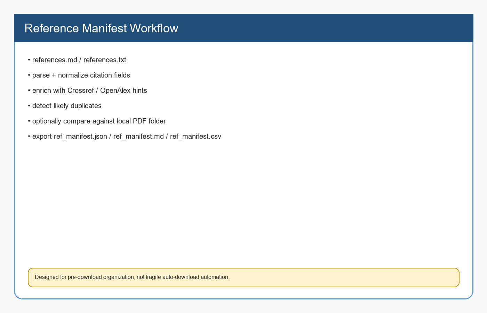
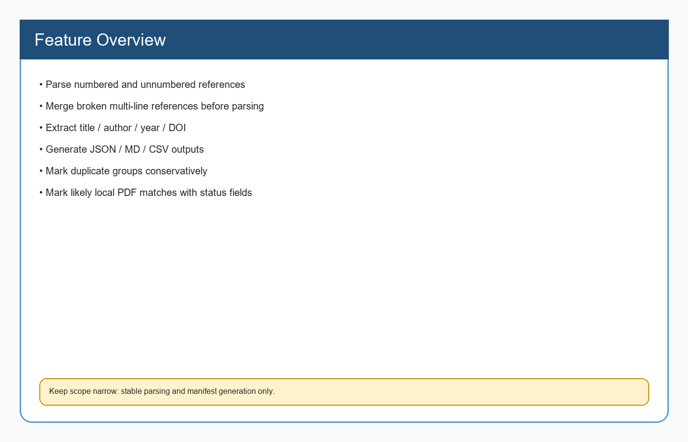
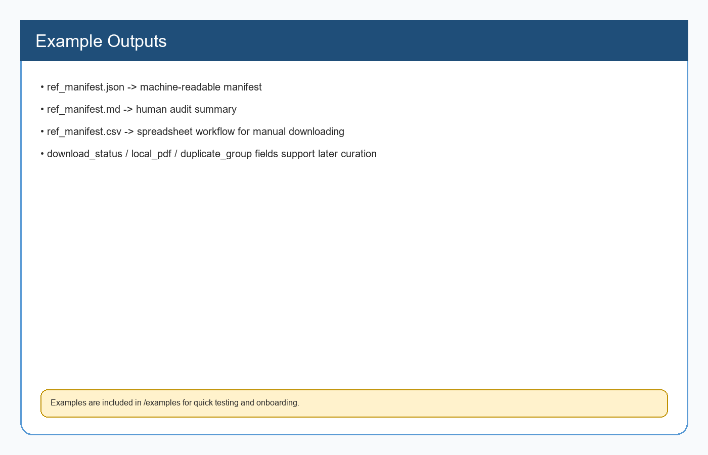

# 2Download--reference_manifest

[](./LICENSE)
[](./SKILL.md)
[](https://github.com/Ro2robin/2Download--reference_manifest/actions)
[](https://github.com/Ro2robin/2Download--reference_manifest/releases)
[](./README.zh-CN.md)

Language / 言語 / 语言:
- [中文说明](README.zh-CN.md)
- [English](README.en.md)
- [日本語](README.ja.md)

## What this repository does

This repository packages a focused OpenClaw skill that turns a references list into a structured manifest.

It can:
- parse references
- extract author / year / title / DOI
- enrich entries with Crossref / OpenAlex hints
- expose `article_url` that can directly open the paper landing page
- generate `ref_manifest.json`
- generate `ref_manifest.md`
- generate `ref_manifest.csv`
- detect likely duplicates
- optionally compare against an existing local PDF folder



## Why `article_url` matters

A manifest is much more useful when it contains not only metadata, but also a direct web entry point to the paper.

This repository now emphasizes:
- `article_url`
- `crossref.url`

These URLs can often be opened directly as:
- DOI pages
- article landing pages
- journal/paper webpages

That makes later manual downloading much easier.

## Feature overview



| Feature | Status | Notes |
|---|---|---|
| Numbered reference parsing | ✅ | `1. ...` style works well |
| Unnumbered one-line parsing | ✅ | Basic support |
| Broken multi-line reference merge | ✅ | Merges before parsing |
| DOI extraction | ✅ | Direct DOI + resolved DOI |
| Article URL extraction | ✅ | `article_url` field added |
| Crossref enrichment | ✅ | Best-effort |
| OpenAlex enrichment | ✅ | Best-effort |
| JSON output | ✅ | Main machine-readable manifest |
| MD output | ✅ | Human audit summary |
| CSV output | ✅ | Spreadsheet workflow |
| Duplicate grouping | ✅ | Conservative heuristics |
| Local PDF folder matching | ✅ | Filename heuristic |

## Workflow

```text
references.md / references.txt
        ↓
parse + normalize
        ↓
Crossref / OpenAlex enrichment
        ↓
article_url selection
        ↓
duplicate detection
        ↓
optional local PDF matching
        ↓
ref_manifest.json / .md / .csv
```

## Quick start

```bash
python scripts/extract_ref_manifest.py references.md --out-dir ./out
```

Optional local PDF comparison:

```bash
python scripts/extract_ref_manifest.py references.md --out-dir ./out --local-pdf-dir ./papers
```

Parse a single reference:

```bash
python scripts/normalize_reference.py "Lee, J. D., & See, K. A. (2004). Trust in automation: Designing for appropriate reliance. Human Factors, 46(1), 50-80."
```

## Outputs

- `ref_manifest.json` — structured machine-readable manifest
- `ref_manifest.md` — quick audit summary
- `ref_manifest.csv` — easy manual review in Excel / Sheets
- `article_url` — direct article webpage / landing-page hint where available



## Repository structure

```text
2Download--reference_manifest/
├── .github/
│   └── workflows/
│       └── ci.yml
├── assets/
│   ├── feature-overview.png
│   ├── sample-output-overview.png
│   └── workflow-overview.png
├── examples/
│   ├── README.md
│   ├── sample_references.md
│   ├── sample_ref_manifest.json
│   ├── sample_ref_manifest.md
│   ├── sample_ref_manifest.csv
│   └── sample_run.sh
├── scripts/
│   ├── normalize_reference.py
│   └── extract_ref_manifest.py
├── CHANGELOG.md
├── CONTRIBUTING.md
├── LICENSE
├── README.md
├── README.zh-CN.md
├── README.en.md
├── README.ja.md
└── SKILL.md
```

## Examples

See `examples/` for:
- minimal input references
- sample JSON output
- sample MD output
- sample CSV output
- a minimal run command

## Intended usage model

This skill is best used as a **pre-download organizer**.
You feed it a references section, and it gives you a manifest with metadata, duplicate hints, and article URLs that make later manual literature work much faster.

## What still needs improvement

- better support for more citation styles
- stronger parsing for messy Chinese / Japanese mixed references
- smarter local PDF matching beyond filename heuristics
- optional DOI-first verification mode
- richer duplicate detection for near-duplicate titles
- smarter ranking for `article_url` selection across Crossref / OpenAlex / DOI

## Maintenance notes

This repository should stay focused on reference parsing and manifest generation.

## License

MIT
